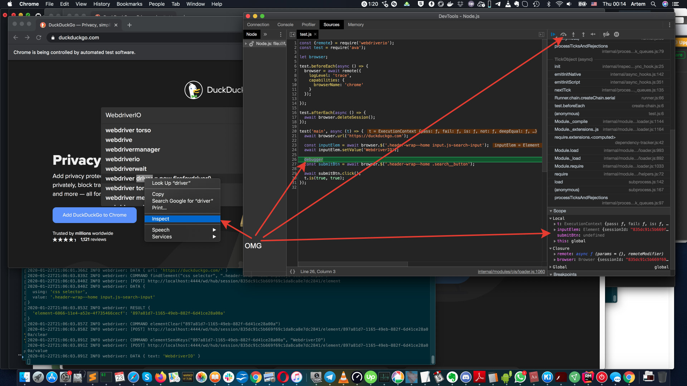

# ava-webdriverio-demo

[](https://circleci.com/gh/artemv/ava-webdriverio-demo)

This is a small project to demo use of [Webdriver.IO](https://webdriver.io)(Standalone mode) together with [Ava](https://github.com/avajs/ava) testing framework.

## Installation
```
git clone git@github.com:artemv/ava-webdriverio-demo.git
yarn --frozen-lockfile

# Install and start webdriver-manager
yarn global add webdriver-manager
webdriver-manager update
webdriver-manager start
```

## Run test
```
yarn test
```

## Debug test

1) Open "chrome://inspect/#devices" in Chrome.
1) Click "Open dedicated DevTools for Node"

Then in terminal window run:
```
yarn ava debug test/test.js
```
The debugger will hook up automatically:

